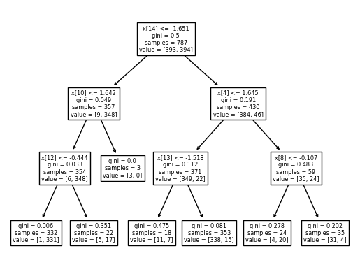

# Credit-Card-fraud-detection-system-using-Machine-Learning

Detect Fraudulent Credit Card transactions using different Machine Learning models and compare performances

In this notebook, I explore various Machine Learning models to detect fraudulent use of Credit cards. I compare each model performance and results.

Please note that this approach can be transferred to other detection analysis in alternatrive domains. The feature extraction process remains similar and can be replicated on many other detection issues.

# Problem Statement

In this project we want to identify fraudulent transactions with Credit Cards.
Our objective is to build a Fraud detection system using Machine learning techniques.
In the past, such systems were rule-based. Machine learning offers powerful new ways.

The project uses a dataset of 300,000 fully anonymized transactions. Each transation is labelled either fraudulent or not fraudulent.

# Techniques used in the project

The project compares the results of different techniques :

- Logistic Regression
- Support Vector Classifier(SVC) / Support Vector Machine(SVM)
- Decision Tree Classifier

# Results

If "Accuracy on Training Data(0.900 = 90%) > Accuracy on Test Data(0.500 = 50%)" Then Model will be Over fitting.
If "Accuracy on Training Data(0.500 = 50%) < Accuracy on Test Data(0.900 = 90%)" Then Model will be Under fitting.
If "Accuracy on Training Data(0.900 = 90%) = Accuracy on Test Data(0.900 = 90%)" Then Model performs very well.

Logistic Regression Model :
Accuracy on Training Data : 0.9390088945362135
Accuracy on Test Data :  0.9238578680203046
Therfore, Then Model performs very well.

SVC/SVM Model :
Accuracy on Training Data : 0.9085133418043202
Accuracy on Test Data :  0.9035532994923858
Therfore, Then Model performs very well.

Decison Tree Classifier Model :
Accuracy on Training Data : 0.9542566709021602
Accuracy on Test Data :  0.883248730964467
Therfore, Then Model performs very well.

